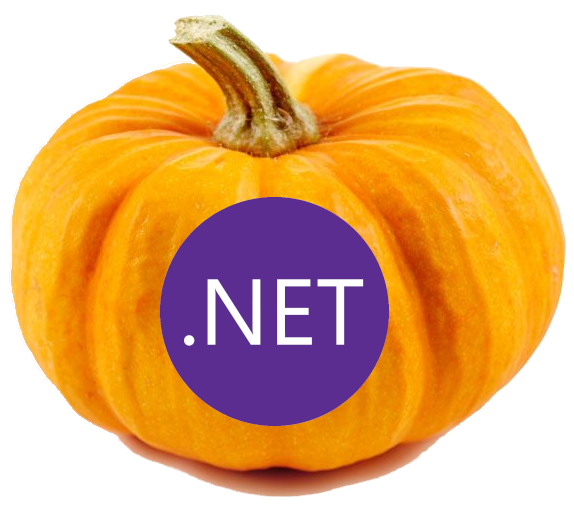

# Marrow XPlat

It is a cross platform (desktop and mobile) application framework for .NET which aims to close the gap between differently evolved systems by providing reliable real APIs for everyone.

## Status

| Group | Interface | Members |
| --- | --- | --- |
| ApplicationModel | IBrowser | OpenAsync(uri) |
| ApplicationModel | IEmail | IsComposeSupported, ComposeAsync(message) |
| Storage | IFileSystem | CacheDirectory, AppDataDirectory |
| Storage | IPreferences | Clear, Set(key, value), Get(key, default), ContainsKey(key), Remove(key) |

## Build

```bash
dotnet workload install android
dotnet build
dotnet run
```

## License

Marrow.XPlat is made available under the terms and conditions of the [AGPL license](LICENSE).
